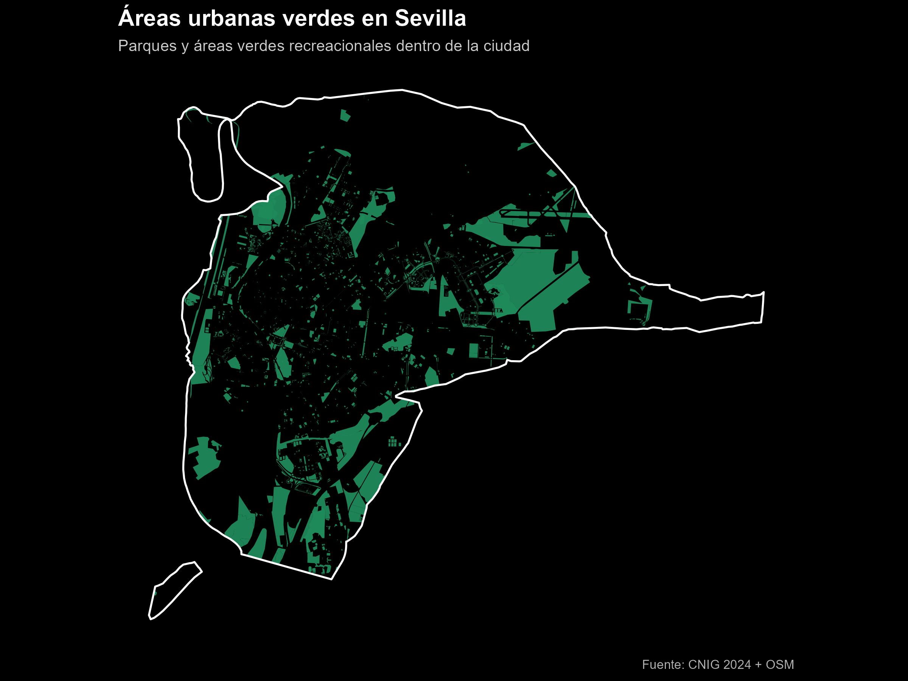
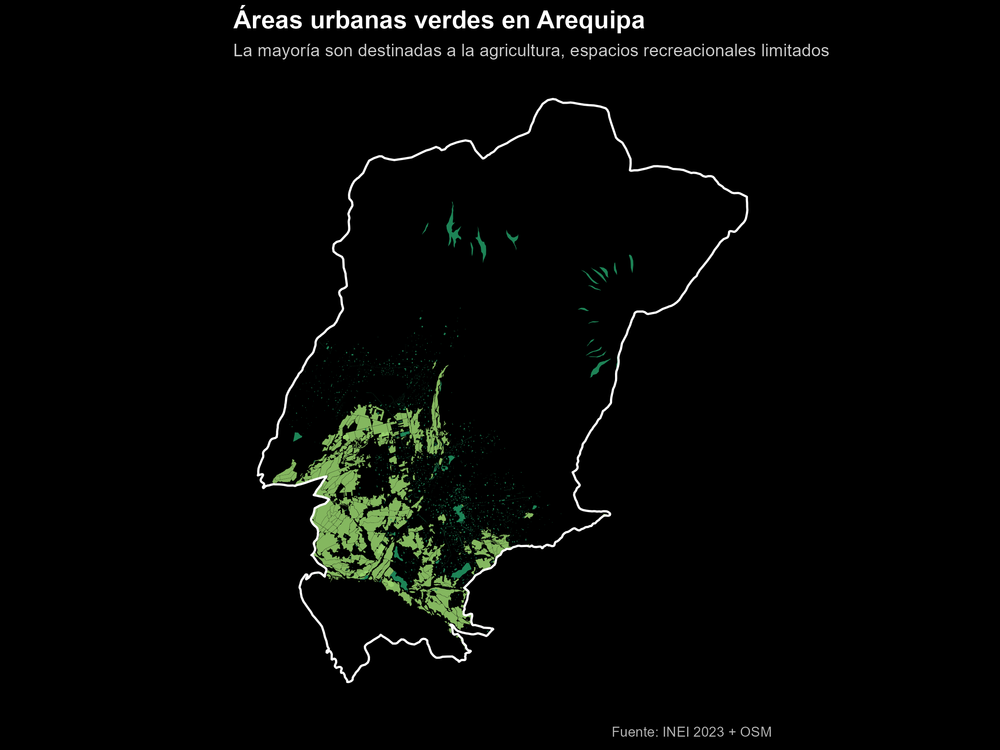

---

## Otro estudio de comparación de dos ciudades: Cuando los espacios verdes no son necesariamente para la gente – Arequipa y Sevilla

En el primer artículo de esta serie comparé los espacios verdes en Londres y Lima, resaltando como decisiones de planeamiento estratégico y capacidad institucional forjaron el acceso urbano a espacios verdes en ambas capitales. En este segundo artículo, me ocupo de dos ciudades que a primera vista no son fácilmente comparables: Sevilla, España y Arequipa, Perú.

Vistas desde el cielo ambas ciudades parecen relativamente “verdes”. Sin embargo, una mirada más cercana, refleja una clara distinción: no todo el espacio verde es para la gente. Campos, granjas y tierras agrícolas pueden dominar el espacio urbano en algunas ciudades; mientras que, parques accesibles y áreas recreacionales se mantienen escasos.

Este artículo explora esta distinción al cuantificar y mapear las áreas verdes en Sevilla y Arequipa, poniendo énfasis al uso que se les da.

## Por qué comparar Arequipa y Sevilla

La comparación no es obvia ya que existen diferencias en término de ingresos, actividades económicas, condiciones geográficas e instituciones. Aun así, comparten características que hacen que la comparación sea valiosa:

- Son capitales regionales históricas, no capitales nacionales
- Poseen centros urbanos compactos rodeados por tierras periurbanas
- Experimentan climas cálidos en el cual el espacio verde juega un rol crucial como termorregulador impactando a la salud pública
- En ambas ciudades la expansión urbana se ha visto restringida por consideraciones medioambientales

Más importante aún, ellas ilustran dos modelos distintos de gestión de áreas verdes dentro del área metropolitana. Como alguien nacido en Arequipa este análisis posee una motivación personal para entender y poder mejorar el acceso a áreas verdes en la ciudad. La tabla 1 presenta las principales características demográficas de ambas ciudades.

::: {.table-captioned}
*Tabla 1: Variables Demográficas*

| Dimensión                  | Municipalidad de Sevilla | Arequipa Metropolitana |
|-----------------------------|----------------|-------------------|
| Área                       | 140 km²      | 680 km²         |
| Población (2024)           | 690,000    | 1,000,000      |
| PIB per capita, PPA (2024)  | $57,000        | $17,800           |

Notas: PIB per cápita, PPA ($ a precios internacionales actuales). Las cifras corresponden a España para Sevilla y Perú para Arequipa.  
Source: Elaboración propia, Banco Mundial (2024); Wikipedia.

:::

## Metodología

Las áreas verdes se identificaron usando data de OpenStreetMap (OSM), restringida a los límites administrativos oficiales de ambas ciudades. 
Las áreas verdes se obtuvieron usando categorías de OSM data (parques, jardines, bosques, praderas, etcétera). Sin embargo, para Arequipa, el análisis requirió separar las áreas verdes en dos categorías.

1. Tierras destinadas a la agricultura
- Tierras agrícolas
- Huertos
- Viveros
- Otras tierras de cultivo

2. Áreas verdes urbanas (parques & recreación)
- Parques públicos y jardines
- Canchas de deportes
- Parques de diversiones
- Vegetación urbana natural

Todas las geometrías fueron proyectadas al sistema de coordenadas correspondiente antes de calcular la extensión de áreas y porcentaje de áreas verdes.
 
## Resultados

### Sevilla: Espacio verde como infraestructura urbana

Sevilla cuenta con un **18%** de cobertura de áreas verdes en espacio público, un valor relativamente alto. En esta ciudad parques, jardines y espacios recreacionales se encuentran integrados dentro del planeamiento urbano, contando con parques de gran extensión - como el parque de María Luisa - que se complementa con parques más pequeños distribuidos en los distritos.

A pesar de que las áreas verdes no se encuentran distribuidas equitativamente a través del territorio, el patrón dominante muestra que la mayoría de ella están destinadas al uso público. Lo cual hace de Sevilla un caso valioso para ejemplificar el acceso a áreas verdes en una ciudad europea consolidada con décadas de planeamiento e inversión en infraestructura verde.

  

  
  {.talk-image}

### Arequipa: Verde, pero no para la gente

A escala del área metropolitana de Arequipa, la ciudad presenta una cantidad importante de áreas verdes. Sin embargo, al separar las tierras agrícolas del espacio verde recreativo, el panorama cambia.

::: {.table-captioned}
*Tabla 2: Composición de áreas verdes en Arequipa Metropolitana*

| Tipo de área verde          | Área (km²) | % Áreas verdes | % Área de la ciudad |
|-----------------------------|----------------|------------------|---------------------
| Tierra agrícola                      | 59    | 85%           |   8.7%
| Areas urbanas verdes (parques, etc)        | 10    | 15%           |   1.5%

Source: Elaboracón propia usando OSM e INEI

:::

En Arequipa Metropolitana las áreas verdes cubren el **10%** de la superficie. Sin embargo, parques y espacios verdes recreacionales representan únicamente el **1.5%**.

La gran mayoría de tierra verde está destinada a la agricultura – que se concentra a lo largo de la periferia de la ciudad y los valles del río Chili – siendo prácticamente inaccesible para los residentes para actividades recreativas.

Esta diferencia es notoria. Por un lado, desde una vista satelital o analizando cifras, Arequipa parecería moderadamente verde. Por otro lado, desde la perspectiva de un residente buscando sombra, ocio, un lugar para correr, hacer deporte o resguardo del calor, la ciudad se encuentra bastante limitada.

Para hacer esta distinción clara, el análisis produce un único mapa para Arequipa con tres elementos.

- Límite metropolitano (color blanco)
- Tierra de cultivo (verde claro)
- Espacios urbanos verdes (verde oscuro)

En el mapa se puede apreciar que las áreas verdes se encuentran alejadas de los centros urbanos que concentran a la mayoría de la población. Resaltando la falta de planificación en infraestructura urbana funcional.

  

  
  {.talk-image}

## Hallazgos principales

1. **Cobertura verde de por si puede ser una métrica que induce al error.** Contar terreno sin considerar el uso de la tierra tiende a sobreestimar el acceso a áreas verdes en ciudades donde la agricultura es una actividad predominante.
2. **El área verde de Arequipa es productiva, no recreacional.** El área agrícola tiene un rol económico y medioambiental de gran valor, pero no cubre el rol de parques y los efectos positivos que estos generan en la población.
3. **La forma en que se distribuye importa.** El espacio verde en Sevilla se mezcla entre los distritos, mientras que en Arequipa las áreas verdes de recreación son muy escasas y concentradas en pocos distritos.
4. **El cambio climático amplifica el problema.** En ciudades con un clima cálido, ubicadas a gran altitud como Arequipa, la ausencia de área verde accesible tiene implicaciones directas para la salud y calidad de vida de los ciudadanos.

## Mensaje de Política

El mensaje de política no es que las tierras agrícolas deben ser reemplazadas, por el contrario.

**Arequipa**

- Proteger las tierras agrícolas como activos culturales y medio ambientales
- Planificar la creación de áreas verdes recreativas, especialmente en distritos con alta densidad poblacional
- Priorizar la creación de parques de mediana extensión distribuidos en la ciudad y vías verdes públicas

**Sevilla**

- Continuar con la inversión en áreas verdes de acceso público
- Enfocarse en la conectividad entre áreas verdes
- Promover el acceso igualitario de áreas verdes entre distritos
- Priorizar el diseño urbano resistente al calor a medida que la temperatura aumenta

## Conclusiones

Arequipa y Sevilla presentan una importante lección en planeamiento urbano. El espacio verde no se refiere únicamente a territorio, se trata de acceso, propósito y gente. Algunas ciudades pueden parecer verdes mientras que estas áreas son inaccesibles para sus residentes. Por ello, calcular áreas verdes con atención al uso que se les da resulta de mayor valor y muestra el camino a seguir en cuanto a la toma de decisiones de política que mejoren la calidad de vida de la población.

A fin de cuentas, la pregunta que interesa no es ¿Qué tan verde es tu ciudad? Si no, ¿Qué tan verde es tu ciudad para la gente que vive en ella?

## Mapas Interactivos

### Mapa interactivo para Sevilla

El mapa interactivo muestra el porcentajes de áreas verdes en la municipalidad de Sevilla. No fue posible obtener las geometrías a nivel de distrito del Instituto Geográfico Nacional de España.

<iframe src="sevilla_green_share_mun.html"
        width="100%"
        height="650px"
        style="border:none;"
        title="Interactive map of green area share by municipality in Seville">
</iframe>

*Source: OpenStreetMap, CNIG. Elaboración propia.*

---

### Mapa Interactivo de Arequipa Metropolitana

El mapa interactivo muestra el porcentajes de áreas verdes epor distrito en Arequipa metropolitana, incluyendo áreas destinadas a la agricultura y espacios verdes recreacionales.

<iframe src="arequipa_green_share_district.html"
        width="100%"
        height="650px"
        style="border:none;"
        title="Interactive map of green area share by district in Metropolitan Arequipa">
</iframe>

*Source: OpenStreetMap, INEI. Elaboración propia.*

## Referencias

- Instituto Geográfico Nacional (CNIG). (2025). *Límites municipales, provinciales y autonómicos*. https://centrodedescargas.cnig.es/CentroDescargas/informacion-geografica-referencia  
- Instituto Nacional de Estadística e Informática (INEI). (2023). *Límites distritales del Perú*.  
- Colaboradores de OpenStreetMap. (2025). *OpenStreetMap planet dump*. Disponible bajo la Licencia de Base de Datos Abierta (ODbL). https://www.openstreetmap.org/copyright
- Banco Mundial. (2024). Indicadores del Desarrollo Mundial.  

**Licencia de datos y notas:**  
- Los datos de OpenStreetMap se proporcionan bajo *Open Database License (ODbL)*. Los usuarios pueden copiar, modificar y publicar datos derivados de OSM, siempre que dichos datos se compartan bajo la misma licencia y se otorgue el crédito correspondiente.  

**Código y reproducibilidad:**  
El código de análisis, los scripts de procesamiento y las instrucciones para reproducir los mapas están disponibles en GitHub: [green_cities_part_2 repository](https://github.com/harryaquije/green_cities_part_2).
